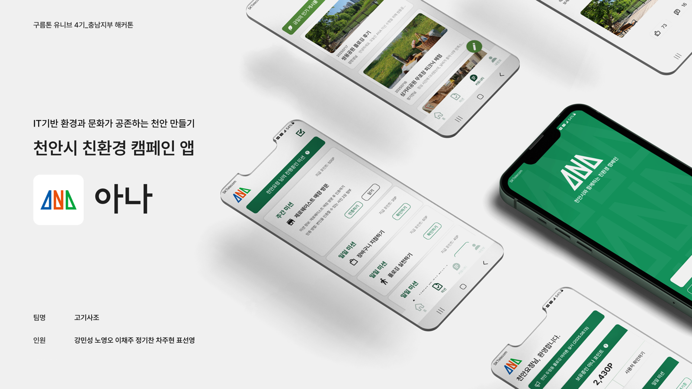
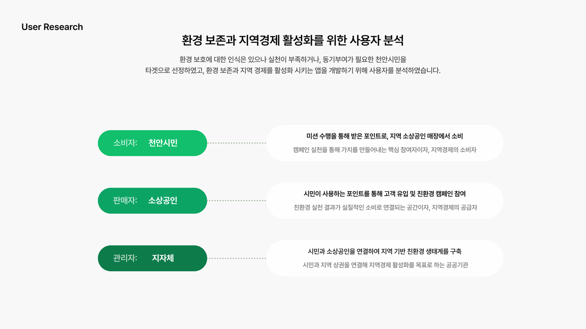
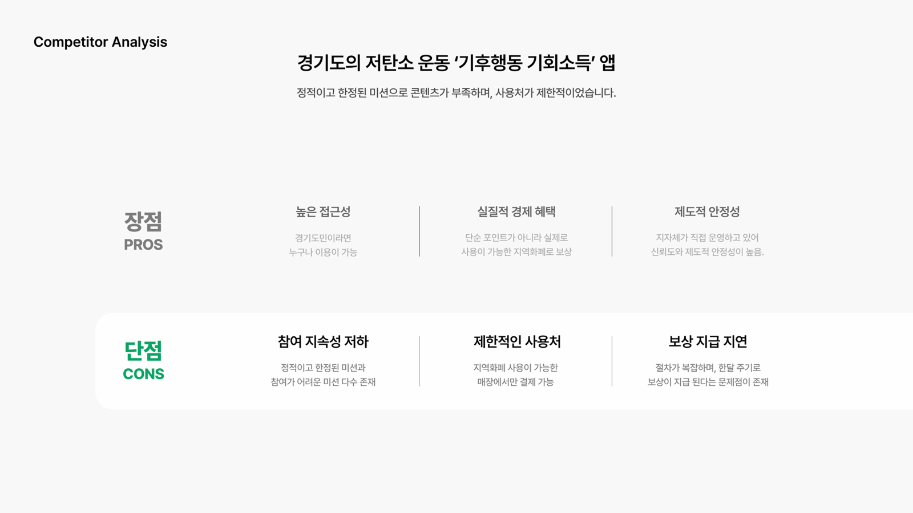
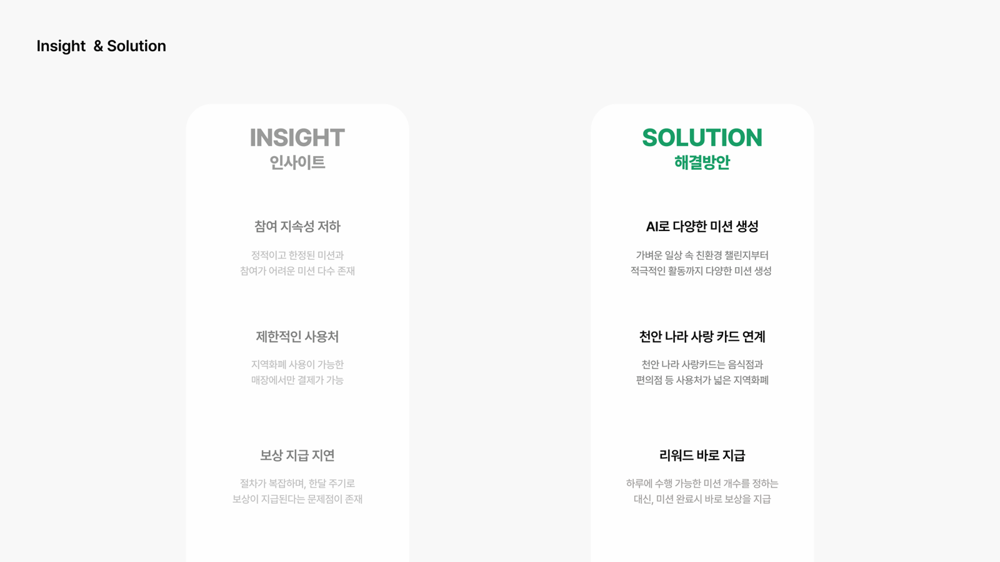
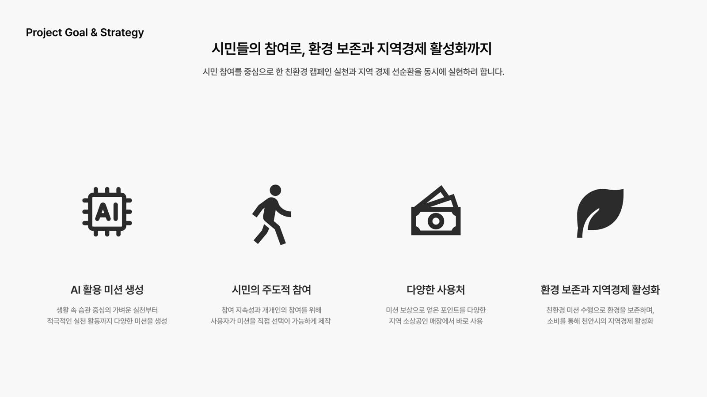
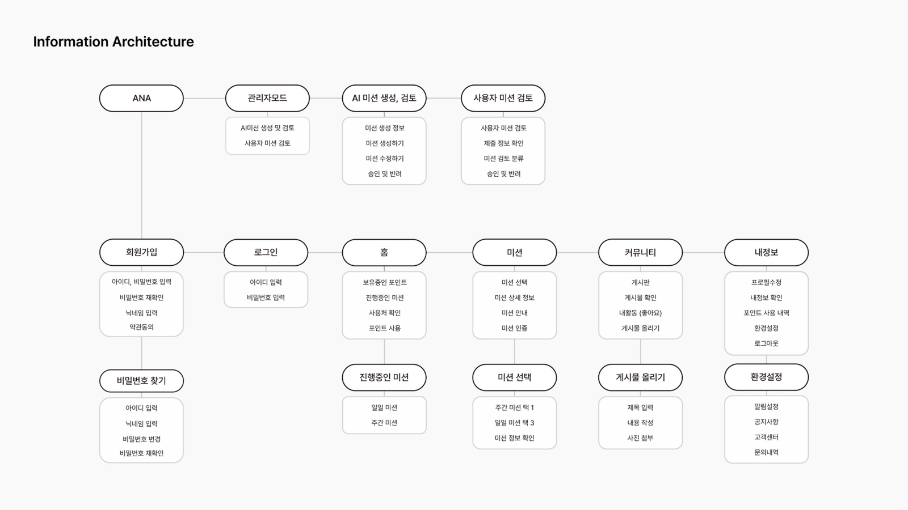
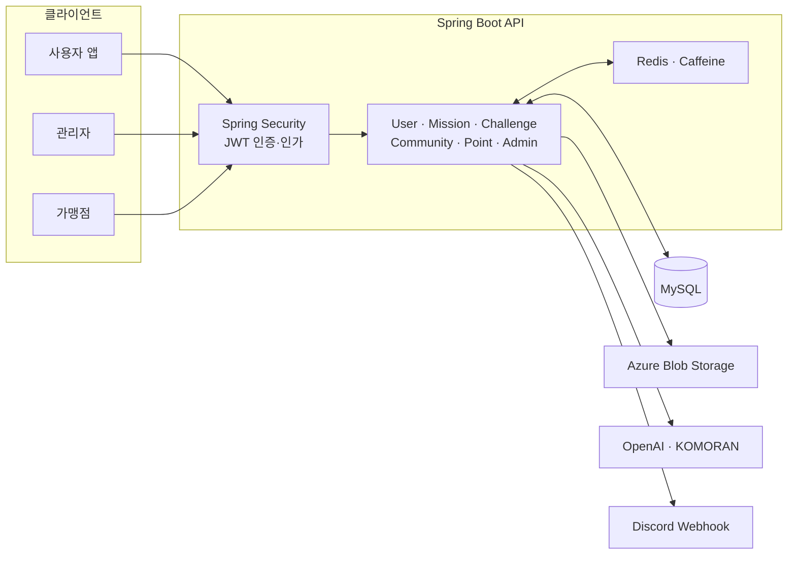

<div align="center">

# ANA Backend

### 천안시 친환경 캠페인 플랫폼

**IT 기반 환경과 문화가 공존하는 천안 만들기**

ANA는 천안시민이 일일·주간 친환경 미션을 선택하고 사진으로 활동을 인증해 포인트를 받는 참여형 캠페인 플랫폼으로, 획일적인 미션과 느린 보상이라는 기존 캠페인의 한계를 보완하여 시민의 친환경 실천이 지역 소상공인 소비로 이어지는 환경 보전과 지역경제 활성화의 선순환을 만듭니다.

</div>



## 기획 배경








## 서비스 목표와 정보 구조






## 시스템 구성



| 구분 | 기술 |
| --- | --- |
| Language | Java 21 |
| Framework | Spring Boot 3.5.3, Spring Web, Spring Data JPA |
| Security | Spring Security, JWT, BCrypt |
| Database | MySQL |
| Cache | Redis, Caffeine |
| AI | OpenAI Java SDK, KOMORAN |
| Storage | Azure Blob Storage |
| QR | ZXing |
| Monitoring | Logback, Discord Webhook |
| Test | JUnit 5, Spring Boot Test, Testcontainers |
| Build | Gradle 8.x |

## 프로젝트 구조

```text
src
├── main
│   ├── java/com/chungnam/eco
│   │   ├── admin        # 관리자 미션 관리, AI 미션 생성, 챌린지 심사
│   │   ├── challenge    # 사용자 미션 인증과 제출 처리
│   │   ├── common       # 설정, 보안, JWT, 예외, 저장소, 운영 알림
│   │   ├── community    # 게시글, 이미지, 좋아요
│   │   ├── mission      # 미션과 사용자 미션, 만료 스케줄러
│   │   ├── point        # 포인트 내역, QR 생성, 사용 처리
│   │   ├── user         # 계정, 토큰, 사용자용 미션·커뮤니티 API
│   │   └── Application.java
│   └── resources
│       ├── application.yml
│       ├── logback-spring.xml
│       └── pay          # QR 포인트 사용 화면
└── test
    ├── java             # 통합·캐시·스케줄러·포인트 테스트
    └── resources        # 테스트 설정과 데이터
```


## 기술적 특징

- **캐시 계층화**: Redis와 Caffeine을 함께 사용해 미션 조회 부하를 줄였습니다.
- **데이터 정합성**: 포인트 적립·차감 시 비관적 락을 사용해 동시 요청을 제어합니다.
- **보상 트랜잭션**: 챌린지 승인과 포인트 지급을 하나의 업무 흐름으로 처리합니다.
- **실패 보상 처리**: 이미지 또는 DB 저장이 실패하면 먼저 생성한 임시 리소스를 정리합니다.
- **콘텐츠 품질 관리**: OpenAI가 생성한 미션과 기존 미션의 유사도를 KOMORAN으로 비교합니다.
- **운영 자동화**: 일일·주간 미션 만료 스케줄러와 Discord 오류 알림을 제공합니다.
